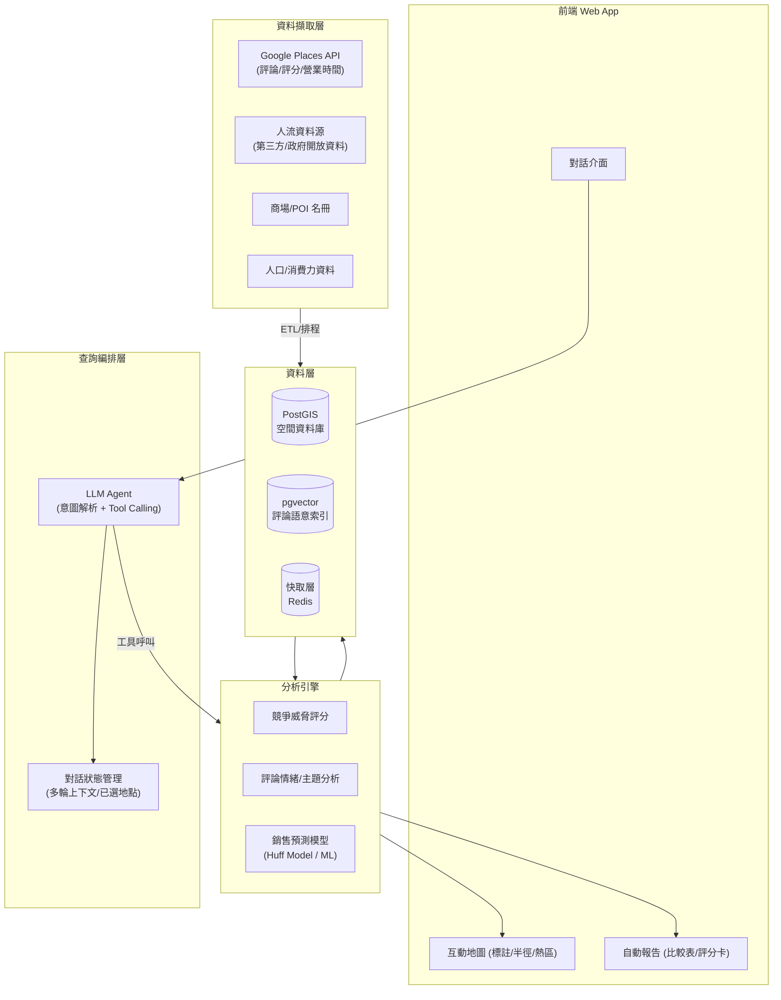

# Talk to Map — 架構規劃

狀態：規劃草案 v0.1（尚未開發）
情境範例：吉隆坡 Bukit Bintang / TRX 商圈商場競爭分析（118 Mall、The Exchange TRX、Pavilion KL、Lot 10、Berjaya Times Square）

---

## 1. 產品願景

讓商場開發商 / 招商團隊 / 品牌選址人員，用一句自然語言問題，就能得到「地圖上標好位置 + 有數據支撐的結構化分析」，取代目前手動查 Google 評論、估人流、做 Excel 比較表的流程。

核心價值主張三件事同時發生：
1. **問答（Talk）**：自然語言輸入問題，不用學查詢語法
2. **定位（Map）**：結果一定落在地圖上，帶半徑、路線、鄰近關係
3. **判斷（Insight）**：不是丟一堆原始資料，而是給結論——威脅層級、定位建議、銷售預測區間

## 2. 使用者旅程範例

以截圖情境還原一次典型互動：

```
使用者：「118 Mall 開幕後，附近哪些商場受威脅最大？」

系統流程：
1. NLU 解析出：地點 = 118 Mall（Jalan Hang Tuah 一帶），
   意圖 = 競爭威脅分析，範圍 = 步行/車程可及半徑
2. 空間查詢：以 118 Mall 為圓心抓半徑內同類型商場
   （The Exchange TRX、Pavilion KL、Lot 10、Berjaya Times Square…）
3. 對每個競品：抓 Google Places 評論/評分做定位關鍵字萃取
   （高端主流 / 日系定位 / 大眾室內主題樂園…），抓年人流估算、
   店鋪數、開幕時間
4. 威脅評分模型：依「定位重疊度 × 距離 × 客群重疊 × 規模差」
   算出分級（極高／高／中／低）
5. 呈現：地圖上依威脅層級標色的商場圖釘 + 半徑圈，
   右側自動生成比較表（如截圖），並附一段文字結論
```

使用者可以繼續追問（多輪對話）：「那如果 118 Mall 主打美食廣場，跟哪家重疊最大？」——系統要能延續上下文，不必重新框定範圍。

## 3. 系統架構總覽



## 4. 核心模組拆解

### 4.1 資料擷取層（Ingestion）
- **Google Places API**：Place Details（評分、評論文字、營業時間、Popular Times）、Nearby Search（同業態競品掃描）
- **商場/POI 名冊**：政府開放資料、OSM、人工建檔起步（如截圖表格內容即可作為種子資料）
- **人流資料**：無現成資料時，先用 Popular Times 熱度曲線 + 停車位數 + 樓地板面積做**人流估算代理指標**，之後再串接付費人流服務（如 Placer.ai 類型服務或當地電信商基地台匿名數據）補強
- **人口/消費力資料**：政府普查、商圈消費力報告，作為銷售預測模型的輸入變數
- 全部經排程 ETL 寫入 PostGIS，評論文字另外做 embedding 存入 pgvector

### 4.2 空間資料層
- **PostgreSQL + PostGIS**：所有地點/商場/POI 存經緯度與多邊形（商圈範圍），支援半徑查詢、最近鄰查詢
- **pgvector**：評論文字向量化後可做語意搜尋（例如「找抱怨排隊/停車難的評論」）
- **Redis 快取**：高頻查詢（熱門商場資料）減少重複呼叫 Google API（有配額與費用限制）

### 4.3 查詢編排層（NL → 結構化查詢）
- 使用 LLM 的 **tool calling**：把自然語言問題轉成一組工具呼叫，例如
  `get_nearby_competitors(center, radius, category)`、
  `get_review_sentiment(place_id)`、
  `estimate_foot_traffic(place_id)`、
  `forecast_sales(place_id, catchment)`
- 對話狀態管理：記住使用者目前鎖定的地點/範圍，支援多輪追問
- 這一層刻意讓 LLM 只「決定呼叫哪個工具、帶什麼參數」，實際計算全部在後端分析引擎完成，避免 LLM 幻覺數字

### 4.4 分析引擎
- **競爭威脅評分**：`威脅分數 = f(定位重疊度, 距離衰減, 客群重疊, 規模/資源差距)`，對應到截圖中的「極高/高/中/低」分級，初期用可解釋的加權公式，之後可用歷史開幕案例回測調整權重
- **評論情緒/主題分析**：對 Google 評論做面向式情緒分析（服務、動線、停車、品牌組合等面向），萃取出「核心定位」關鍵字（如截圖中的高端主流/日系定位）
- **銷售預測模型**：起步用零售地理學經典的 **Huff Model（引力模型）**——以商場規模、旅行時間/距離、消費者選擇機率推估商圈內客流分配與營收，之後有實際歷史數據再疊加 ML 迴歸模型精修
- 三者都要輸出「信心區間」而非單一數字，因為前期資料量有限

### 4.5 呈現層
- **對話介面**：串流回覆 + 结構化卡片（不是純文字）
- **互動地圖**：Mapbox GL JS 或 Google Maps JS API，圖釘依威脅層級上色、可畫半徑圈/商圈多邊形
- **自動報告**：比較表（可還原截圖樣式）、可匯出 PDF/Excel 給招商簡報使用

## 5. 資料來源策略（目前皆無，需從零建立）

| 資料類型 | 起步方案 | 之後升級路徑 |
|---|---|---|
| 商場/POI 基本資料 | 人工建檔種子集 + OSM | 政府開放資料、商用 POI 資料庫（如 SafeGraph） |
| 評論與評分 | Google Places API（有配額/費用，需申請 API Key） | 加入其他評論源（Facebook、當地評論站）做交叉驗證 |
| 人流 | Popular Times 熱度代理 + 樓地板面積/車位數估算 | 付費人流數據商、電信基地台匿名數據、實地計數 |
| 人口/消費力 | 政府普查/開放資料 | 商用消費力資料庫 |

**關鍵風險**：Google Places API 的評論資料有配額限制（每個 place 通常只回傳少量精選評論），無法做大規模評論探勘；人流真實數據取得成本高。建議 MVP 階段先用「評分 + 少量評論 + 人工/開放資料人流」做出可信的相對比較（誰威脅高/低），而非追求絕對數字的精準度。

## 6. 技術選型建議

- **前端**：Next.js (React) + TypeScript + Tailwind + Mapbox GL JS
- **後端 API**：Python (FastAPI)（分析/ML 生態好）或 Node.js（TypeScript 全端一致性好）
- **資料庫**：PostgreSQL + PostGIS + pgvector；Redis 快取
- **LLM**：Claude，透過 tool calling 做查詢編排；評論摘要/情緒分析可用同一模型或輕量分類模型
- **ETL/排程**：簡單 cron job 起步，資料量大再上 Airflow 類工具
- **部署**：先單一容器化服務（Docker）+ 雲端 Postgres，量體成長後再拆服務

## 7. 分階段路線圖

1. **Phase 0（現在）**：架構規劃 ✅、定義資料 schema、種子資料集規劃
2. **Phase 1**：靜態原型——用假資料/人工建檔資料還原截圖那種「比較表 + 地圖標註」畫面，驗證呈現層設計
3. **Phase 2**：串接 Google Places API 真實資料（評分/評論/營業時間），地圖圖釘動態化
4. **Phase 3**：加上對話介面（NL → tool calling → 結果渲染），支援多輪追問
5. **Phase 4**：人流估算模組上線（先用代理指標），威脅評分模型上線
6. **Phase 5**：銷售預測模型（Huff Model 起步），並根據真實案例回測調整

## 8. 待決問題

- 目標城市/商圈範圍是否只鎖定吉隆坡，還是要設計成可跨城市/跨國複用的架構？
- 是否已有 Google Cloud 帳號可申請 Places API Key？預算上限？
- 人流數據最終要串接哪個資料源（付費服務 vs 政府資料 vs 自建估算）？這會決定 Phase 4 的複雜度
- 平台使用者是內部團隊自用，還是要做成 SaaS 給多個客戶用（牽涉多租戶架構）？
